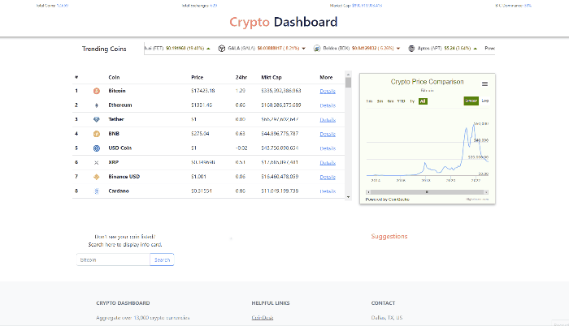

# Crypto Dashboard

### Description   

[Crypto Dashboard](https://gregrodriguezjr.github.io/crypto_dashboard_v2/) is a web application that aggregates over 13,000 crypto currencies. Designed and implemented front-end and backend API capabilities & functionality so users can interact with the price chart to see the history of a chosen coin. Users can click links inside the table to provide additional information inside a modal. Users can search by coin name to display an information card, while getting coin name suggestions.

### Environment   

- HTML/CSS 
- JavaScript
- jQuery 
- Bootstrap 
- CoinGecko API   

### Demo
